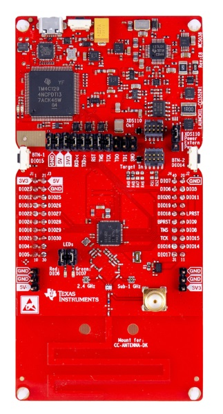

# CHIP cc1352 Lock Example Application

An example application showing the use [CHIP][chip] on the Texas Instruments
CC13X2_26X2 family of Wireless MCUs.


## Introduction



The CC13X2_26X2 lock example application provides a working demonstration of a
connected door lock device. This uses the open-source CHIP implementation and
the Texas Instruments SimpleLink™ CC13x2 and CC26x2 software development kit.

By default this example targets the [CC1352R1_LAUNCHXL][cc1352r1_launchxl]
LaunchPad, but the example application is enabled to build on the whole
`CC13X2_26X2` family of MCUs.

The lock example is intended to serve both as a means to explore the workings
of CHIP, as well as a template for creating real products based on the Texas
Instruments devices.


## Device UI

This example application has a simple User Interface to depict the state of the
door lock and to control the state. The user LEDs on the LaunchPad are set on
when the lock is locked, and are set off when unlocked. The LEDs will flash
when in the transition state between locked and unlocked. The user buttons are
used for requesting lock and unlock of the door lock. The left button (`BTN-1`)
is used to request locking. The right button (`BTN-2`) us used to request
unlocking.


## Building

### Using Native Shell

- The build system usually manages the dependencies. But we have found that it
  is sometimes necessary to force the git submodules to clone.
  ```
  $ git submodule init
  $ git submodule update
  ```

- Download and install the [SimpleLink™ CC13x2 and CC26x2 software development
  kit (SDK)][simplelink_sdk] ([4.30.00.42_eng][simplelink_sdk_4.30.00.42_eng])

  **NOTE: internal release only right now**

  - Follow the default installation instructions when executing the installer.

- Download and install [SysConfig][sysconfig]
  ([sysconfig-1.5.0_1397][sysconfig-1.5.0_1397])

  - **NOTE:** This may have already been installed with your SimpleLink SDK install

- Download and install an ARM gcc tool chain:
  [gcc-arm-none-eabi-9-2020-q2-update][gcc-arm-none-eabi]
  ([gcc-arm-none-eabi-9-2020-q2-update-x86_64-linux.tar.bz2][gcc-arm-none-eabi-9-2020-q2-update])

  - Untar to a useful installation location.
  - The Makefile by default will look at `~/third_party/gcc-arm-none-eabi-9-2019-q4-major`.
  - The SimpleLink SDK requires arm GCC 9 or later.
  - `tar -xjvf gcc-arm-none-eabi-9-2020-q2-update-x86_64-linux.tar.bz2 -C ~/third_party`

- Download and install [FreeRTOS][freertos]
  ([FreeRTOSv10.3.1.zip][freertosv10.3.1]

  - Untar to a useful installation location.
  - The Makefile by default will look at `~/third_party/FreeRTOSv10.3.1`.
  - `unzip FreeRTOSv10.3.1.zip -d ~/third_party`

- Update the location of your installed tools in the `Makefile` in this
  directory. These values should match where you installed or untarred the
  tools in the previous steps.
  ```
  FREERTOS_ROOT           = $(HOME)/third_party/FreeRTOSv10.3.1/FreeRTOS
  CORESDK_INSTALL_DIR     = $(HOME)/ti/simplelink_cc32xx_sdk_4_30_00_13_eng
  SYSCONFIG_INSTALL_DIR   = $(HOME)/ti/sysconfig_1.5.0
  ARM_GCC_INSTALL_ROOT    = $(HOME)/third_party/gcc-arm-none-eabi-9-2020-q2-update
  ```

- Update the configuration of the FreeRTOS build in the SimpleLink SDK. This is
  to enable backwards compatability with older FreeRTOS APIs. Edit the file
  `~/ti/simplelink_cc13x2_26x2_sdk_4_30_00_03_eng/kernel/freertos/builds/cc13x2_cc26x2/release/FreeRTOSConfig.h`
  and set the value below.
  ```
  #define configENABLE_BACKWARD_COMPATIBILITY 1
  ```

- Optionally update the compile rule in the makefile to enable code size optimization and debug symbol inclusiion.
  Edit the file
  `~/ti/simplelink_cc13x2_26x2_sdk_4_30_00_03_eng/kernel/freertos/builds/cc13x2_cc26x2/release/gcc/makefile`
  and add ` -Os -g3 -gdwarf-3 -gstrict-dwarf` to the `CFLAGS`.


- Install some additional tools needed to build. You may do this with your
  system's package manager.
  ```
  # Linux
  $ sudo apt-get install git make automake libtool ccache

  # Mac OS X
  $ brew install automake libtool ccache
  ```
  Or you can try and use the nl helper makefile.
  ```
  $ make -C ${connectedhomeip}/third_party/nlbuild-autotools/repo tools
  ```

- Run the build to produce a default executable.
  ```
  $ cd ~/connectedhomeip/examples/lock-app/cc13x2_26x2
  $ make clean
  $ make
  ```

## Programming

Loading the built image onto a LaunchPad is supported through two methods.
UniFlash can be used to load the image. Code Composer Studio can be used to
load the image and debug the source code.

### UniFlash

[Programming UniFlash](doc/programming-uniflash.md)


### Code Composer Studio

[Programming and Debugging with CCS](doc/programming-ccs.md)


[chip]: https://github.com/project-chip/connectedhomeip
[cc1352r1_launchxl]: https://www.ti.com/tool/LAUNCHXL-CC1352R1
[simplelink_sdk]: https://www.ti.com/tool/SIMPLELINK-CC13X2-26X2-SDK
[simplelink_sdk_4.30.00.42_eng]: https://youtu.be/dQw4w9WgXcQ
[gcc-arm-none-eabi]: https://developer.arm.com/tools-and-software/open-source-software/developer-tools/gnu-toolchain/gnu-rm/downloads
[sysconfig]: https://www.ti.com/tool/SYSCONFIG
[sysconfig-1.5.0_1397]: http://software-dl.ti.com/ccs/esd/sysconfig/sysconfig-1.5.0_1397-setup.run
[gcc-arm-none-eabi]: https://developer.arm.com/tools-and-software/open-source-software/developer-tools/gnu-toolchain/gnu-rm/downloads
[gcc-arm-none-eabi-9-2020-q2-update]: https://armkeil.blob.core.windows.net/developer/Files/downloads/gnu-rm/9-2020q2/gcc-arm-none-eabi-9-2020-q2-update-x86_64-linux.tar.bz2
[freertos]: https://www.freertos.org/index.html
[freertosv10.3.1]: https://github.com/FreeRTOS/FreeRTOS/releases/download/V10.3.1/FreeRTOSv10.3.1.zip
